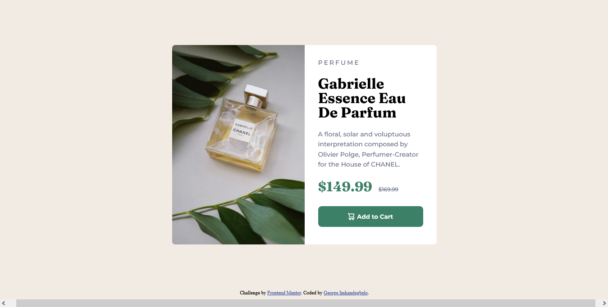

# Frontend Mentor - Product preview card component solution

This is a solution to the [Product preview card component challenge on Frontend Mentor](https://www.frontendmentor.io/challenges/product-preview-card-component-GO7UmttRfa). Frontend Mentor challenges help you improve your coding skills by building realistic projects. 

## Table of contents

- [Overview](#overview)
  - [The challenge](#the-challenge)
  - [Screenshot](#screenshot)
  - [Links](#links)
  - [Built with](#built-with)
  - [What I learned](#what-i-learned)
  - [Author](#author)

## Overview

### The challenge

Users should be able to:

- View the optimal layout depending on their device's screen size
- See hover and focus states for interactive elements

### Screenshot



### Links

- Solution URL: [https://github.com/Imhandegbelo/product-card](https://github.com/Imhandegbelo/product-card)
- Live Site URL: [https://imhandegbelo.github.io/product-card](https://imhandegbelo.github.io/product-card/)

### Built with

- Semantic HTML5 markup
- CSS custom properties
- CSS Flex
- CSS Grid
- Mobile-first workflow

### What I learned

Throught this project, I learnt to center an icon in a button together with the test. The hover color (for the button) was not given in the exercise) so, I had to figure that out myself.
I was able to solve the icon alignment with this css properties

```css
button {
  display: flex;
  align-items: center;
  justify-content: center;
}
```

## Author

- Frontend Mentor - [@Imhandegbelo](https://www.frontendmentor.io/profile/Imhandegbelo)
- Twitter - [@ImhandegbeloG](https://www.twitter.com/ImhandegbeloG)
